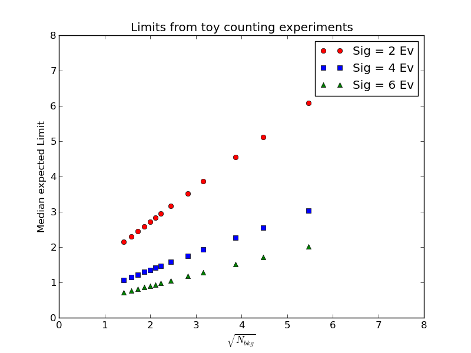
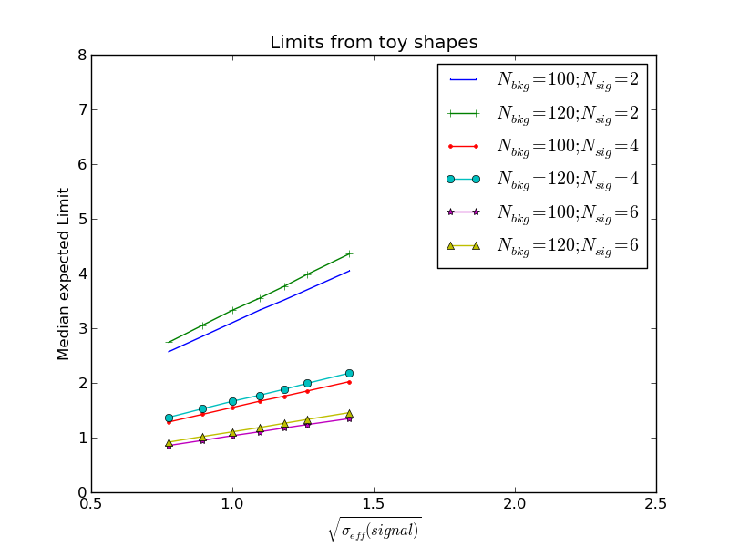

## How to play this toy

### Cut and count

A template card for this game is [card_cut_n_count.txt](card_cut_n_count.txt), in which
the strings `%SIG%` and `%BKG%` will be replaced in a script.  
The corresponding script is [toyLimit_cut_n_count.py](toyLimit_cut_n_count.py). Just run it:

``` python toyLimit_cut_n_count.py ```
You will get a plot like this:  


### Play with shapes 

Template card for this game is [card_shape_n_roll.txt](card_shape_n_roll.txt). Here we
will be replacing `%SIG%`, `%BKG%` and `%SW%` within [toyLimit_shape_n_roll.py](toyLimit_shape_n_roll.py) script.  

``` python toyLimit_shape_n_roll.py ```

You will get a plot like this, which shows how the limits scale with the width of the gaussian:  



And here are the toys generated for that game:


