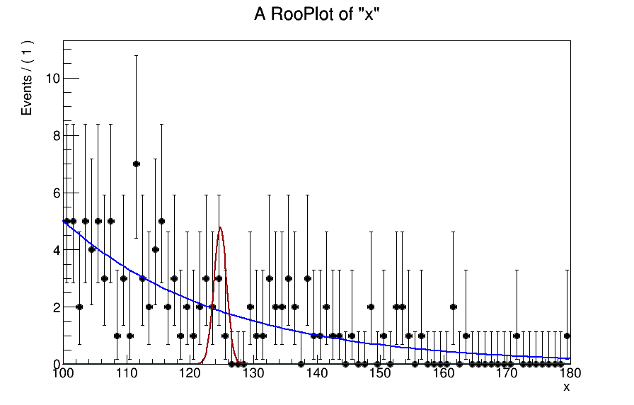

## Read the workspaces 

A script called [readWS.py](readWS.py) alows to read the workspaces from the signal and
background of the actual analysis (also commited here)

## How to play the toys

### Cut and count

A template card for this game is [card_cut_n_count.txt](card_cut_n_count.txt), in which
the strings `%SIG%` and `%BKG%` will be replaced in a script.  
The corresponding script is [toyLimit_cut_n_count.py](toyLimit_cut_n_count.py). Just run it:

``` python toyLimit_cut_n_count.py ```

You will get a plot like this:  


As we can see the relationship between the limit and &sqrt(N_bkg) is indeed
linear. However, we also notice that the line does not cross zero. That means that there
is an offset in the scaling of the limits. We are at the level of small number of events
in the background.  From the backgound `mgg` shape `dN/dmgg = 2 events/GeV`. If we
consider two cases of widths, 2 GeV and 3.2 GeV, we get 4 and 6.4 events
correspondingly. So let's take those numbers and look at how the limits scale:

| N_sig | Limit with N_bkg=4 events | Limit with N_Bkg=6.4 events| (L(4)-L(6.4))/L(4) | compare to &sqrt;6.4/&sqrt;4 - 1 |
| - | - | - | - | - |
| 2 | 2.71 | 3.23 | 0.193 | 0.265 |
| 4 | 1.36 | 1.62 | 0.193 | 0.265 |
| 6 | 0.90 | 1.08 | 0.199 | 0.265 |

That is, already with the counting experiment the limit change is smaller than 26%..

### Play with shapes 

Template card for this game is [card_shape_n_roll.txt](card_shape_n_roll.txt). Here we
will be replacing `%SIG%`, `%BKG%` and `%SW%` within [toyLimit_shape_n_roll.py](toyLimit_shape_n_roll.py) script.  

``` python toyLimit_shape_n_roll.py ```

You will get a plot like this, which shows how the limits scale with the width of the gaussian:  


And here are the toys generated for that game:



