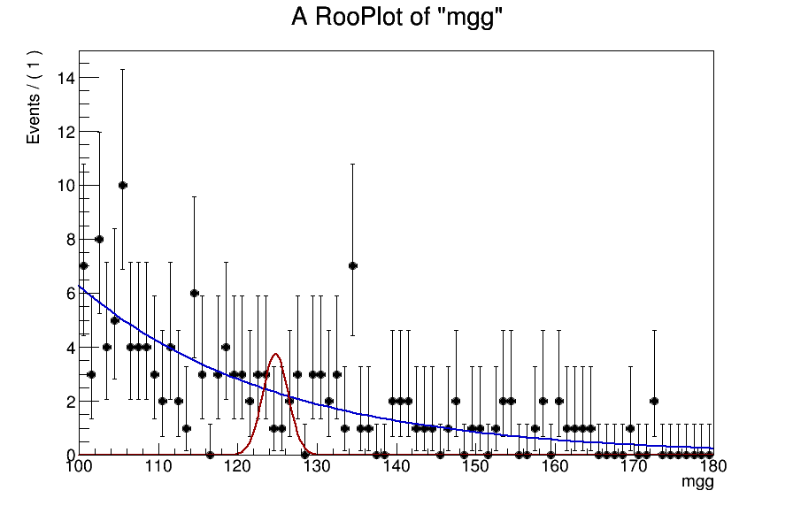
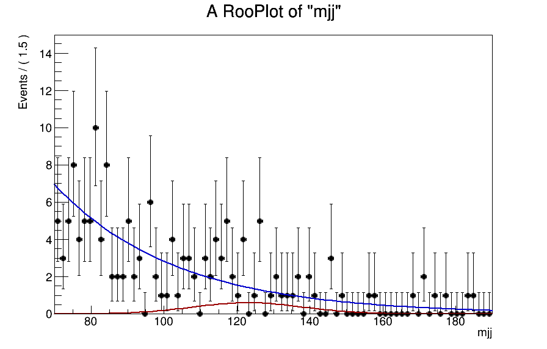

## Read the workspaces 

A script called [readWS.py](readWS.py) allows you to read the workspaces from the signal and
background of the 2016 analysis. These workspaces are also committed here.

Here is a plot of the data distribution and background fit in mgg in the most sensitive
category (excluding single Higgs): 


Total number of data events in this range is 118, signal prediction is 4.27 (normalized to 1 fb cross section).  


## How to play the toys

### Cut and count

A template card for this game is [card_cut_n_count.txt](card_cut_n_count.txt), in which
the strings `%SIG%` and `%BKG%` will be replaced in a script.  
The corresponding script is [toyLimit_cut_n_count.py](toyLimit_cut_n_count.py). Just run it:

``` 
python toyLimit_cut_n_count.py 
```

You will get a plot like this:  


As we can see the relationship between the limit and &Sqrt;(N_bkg) is indeed
linear. However, we also notice that the line does not cross zero. That means that there
is an offset in the scaling of the limits. We are at the level of small number of events
in the background.  From the background `mgg` shape `dN/dmgg = 2 events/GeV`. If we
consider two cases of widths, 2 GeV and 3.2 GeV, we get 4 and 6.4 events
correspondingly. So let's take those numbers and look at how the limits scale:

| N_sig | Limit with N_bkg=4 events | Limit with N_Bkg=6.4 events| (L(6.4)-L(4))/L(4) | compare to &Sqrt;6.4/&Sqrt;4 - 1 |
| - | - | - | - | - |
| 2 | 2.71 | 3.23 | 0.193 | 0.265 |
| 4 | 1.36 | 1.62 | 0.193 | 0.265 |
| 6 | 0.90 | 1.08 | 0.199 | 0.265 |

That is, already with the counting experiment the limit change is smaller than 26%.

### Play with shapes 

Template card for this game is [card_shape_n_roll.txt](card_shape_n_roll.txt). Here we
will be replacing `%SIG%`, `%BKG%` and `%SIGMA%` within
[toyLimit_shape_n_roll.py](toyLimit_shape_n_roll.py) script. In the analysis, Nsig = 4
events, N_bkg = 118 events (total number in 100 &lt; mgg &lt; 180 GeV), &sigma; = 1.0 (with
a bug) or 1.6 GeV (corrected). Signal shape is Gaussian with mean at 125 GeV and variable
&sigma;, while the background is a simple Exponential function.


The toys generated for this game, as well as the background fit used, are shown here:


``` 
python toyLimit_shape_n_roll.py 
```

After running the script, you will get a plot like this, which shows how the limits scale with the width of the Gaussian:  


Indeed, the scaling of limits goes as &Sqrt;&sigma;, nevertheless the ratios at &sigma; = 1.6 to 1.0 GeV are as follows:

| N_bkg | N_sig | Limit with &sigma;(sig) = 1 GeV | Limit with &sigma;(sig) = 1.6 GeV| L(1.6)-L(1.0))/L(1.0) | compare to &Sqrt;1.6/&Sqrt;1 - 1 |
|-|-|-|-|-|-|
| 100 | 2 | 3.10 | 3.70 | 0.194 | 0.265 |
| 120 | 2 | 3.33 | 3.98 | 0.197 | 0.265 |
| 140 | 2 | 3.52 | 4.27 | 0.213 | 0.265 |
| 100 | 4 | 1.55 | 1.85 | 0.194 | 0.265 |
| **120** | **4** | **1.66** | **1.99** | **0.197** | **0.265** |
| 140 | 4 | 1.76 | 2.13 | 0.213 | 0.265 |
| 100 | 6 | 1.04 | 1.24 | 0.196 | 0.265 |
| 120 | 6 | 1.11 | 1.33 | 0.205 | 0.265 |
| 140 | 6 | 1.18 | 1.42 | 0.206 | 0.265 |

In bold is the case closest to our analysis.

Now, let's do a similar thing and instead of using Gaussian for the signal shape we use Double Sided
Crystal Ball function with exactly the same parameters as in the analysis workspaces (before and after the bug fix):

 

Here are the results:  

| N_bkg | N_sig | Limit with bug, &sigma;(eff) = 1 GeV | Limit after fix, &sigma;(eff) = 1.6 GeV| (L(bug)-L(fix))/L(bug) | compare to &Sqrt;1.6/&Sqrt;1 - 1 |
|-|-|-|-|-|-|
| 100 | 2 | 3.27 | 3.77 | 0.153 | 0.265 |
| 120 | 2 | 3.52 | 4.05 | 0.151 | 0.265 |
| 140 | 2 | 3.73 | 4.33 | 0.159 | 0.265 |
| 100 | 4 | 1.63 | 1.88 | 0.153 | 0.265 |
| **120** | **4** | **1.76** | **2.02** | **0.151** | **0.265** |
| 140 | 4 | 1.87 | 2.16 | 0.159 | 0.265 |
| 100 | 6 | 1.09 | 1.26 | 0.158 | 0.265 |
| 120 | 6 | 1.17 | 1.36 | 0.161 | 0.265 |
| 140 | 6 | 1.24 | 1.44 | 0.164 | 0.265 |

The 15% difference is what we also observe in the analysis. 

Note: the width of 1.0 and 1.6 GeV are the _effective sigmas_ of the PDF. In the case of
Crystal Ball function with large tails, a simple scaling with the &sigma;_eff breaks.


### Toys with 2D fits

Un updated version of the [toyLimit_shape_n_roll.py](toyLimit_shape_n_roll.py) script has
an option to run the toys of 2D(mgg, mjj) fit, as well as 1D(mgg) fit after a cut on mjj variable:

``` 
python toyLimit_shape_n_roll.py # 1D fit without mjj cuts
python toyLimit_shape_n_roll.py -t 2D
python toyLimit_shape_n_roll.py --mjj "mjj>100 && mjj<150"
python toyLimit_shape_n_roll.py --mjj eff_sigma_1
```

Results with N_bkg = 120 events, N_sig = 4 events:  

| Fit type         | N_bkg | N_sig | Limit | Diff. wrt 2D, %| 
|-|-|-|-|-|
| 2D(mgg,mjj)                    | 120 | 4.0 | 1.36 |  - | 
| 1D(mgg), no mjj cut            | 120 | 4.0 | 1.99 | 46 | 
| 1D(mgg), mjj in 1 &sigma;_eff  |  24 | 2.7 | 1.65 | 21 | 
| 1D(mgg), mjj in 2 &sigma;_eff  |  51 | 3.8 | 1.51 | 11 | 
| 1D(mgg), 100 < mjj < 150       |  34 | 3.6 | 1.39 |  2 | 


Results with N_bkg = 250 events, N_sig = 9 events:  

| Fit type         | N_bkg | N_sig | Limit | Diff. wrt 2D, % | 
|-|-|-|-|-|
| 2D(mgg,mjj)                    | 250 | 9.0 | 0.78 |  - | 
| 1D(mgg), no mjj cut            | 250 | 9.0 | 1.21 | 55 | 
| 1D(mgg), mjj within 1 &sigma;(eff)  |  49 | 6.1 | 0.93 | 19 | 
| 1D(mgg), mjj within 2 &sigma;(eff)  | 108 | 6.8 | 0.89 | 14 | 
| 1D(mgg), 100 < mjj < 150       |  88 | 8.1 | 0.87 | 12 | 

 
For the results above, the background is modeled as 1-parameter exponential functions in both mgg and mjj.
And the signal is Gaussian with the width close to the expected in the analysis. See figures below:  

 

Now, let's do the same as above, but changing the signal model from Gaussian to
double-sided Crystall Ball, with same parameters obtained from our signal MC.
 
| Fit type         | N_bkg | N_sig | Limit | Diff. wrt 2D, % | 
|-|-|-|-|-|
| 2D(mgg,mjj)                         | 250 | 9.0 | 0.90 |  - | 
| 1D(mgg), no mjj cut                 | 250 | 9.0 | 1.22 | 36 | 
| 1D(mgg), mjj within 1 &sigma;(eff)  |  67 | 6.1 | 1.07 | 19 | 
| 1D(mgg), mjj within 2 &sigma;(eff)  | 147 | 8.1 | 1.09 | 21 | 
| 1D(mgg), 100 < mjj < 150            |  82 | 6.9 | 1.02 | 13 | 


Here is another one, this time reducing the width of the mjj in signal by ~20% (let's hope
for the greatest b-jet regression!):

| Fit type         | N_bkg | N_sig | Limit | Diff. wrt 2D, % | 
|-|-|-|-|-|
| 2D(mgg,mjj)                         | 250 | 9.0 | 0.82 |  - | 
| 1D(mgg), no mjj cut                 | 250 | 9.0 | 1.22 | 49 | 
| 1D(mgg), mjj within 1 &sigma;(eff)  |  49 | 6.1 | 0.95 | 16 | 
| 1D(mgg), mjj within 2 &sigma;(eff)  | 102 | 7.7 | 0.99 | 21 | 
| 1D(mgg), 100 < mjj < 150            |  84 | 7.5 | 0.95 | 16 | 

These are the PDFs of the last toy (two Crystall-Balls, with reduced width of mjj): 
 
 


